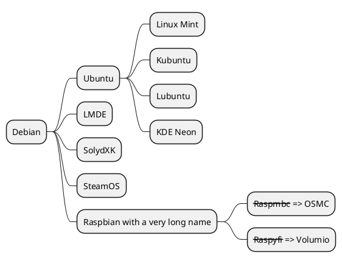

# 操作指南

这是指南内容  

> 本地启动

```shell
#跳转到docsify文件上级
docsify serve #docsify目录名
```
> 任务列表
* [ ] 网页部署gitee page
* [ ] 百度统计插件 24集
* [ ] docsivaline  25集
* [ ] docsify-contributors 13


## Tab语法使用
```shell
<!-- tabs:start -->
#### **English**
Hello!
#### **French**
Bonjour!
<!-- tabs:end -->
```
> 效果
<!-- tabs:start -->

#### **English**

Hello!

#### **French**

Bonjour!

<!-- tabs:end -->

## alerts提示文字

> 编写警告

> [!WARNING]
> 在`[]`里面写入`!WARNING`即可
>
> 这是一个使用了Markdown引用样式美化插件的警告

> 编写危险

> [!Danger]
> 在`[]`里面写入`!Danger`即可
>
> 这是一个使用了Markdown引用样式美化插件的危险

> 编写提示

> [!TIP]
> 在`[]`里面写入`!TIP`即可
>
> 这是一个使用了Markdown引用样式美化插件的提示

> 编写注释

> [!NOTE]
> 在`[]`里面写入`!NOTE`即可
>
> 这是一个使用了Markdown引用样式美化插件的注释

> 编写自定义警告

> [!WARNING|label:Important]
> 在`[]`里面写入`!WARNING|label:Important`即可
>
> 同理`Danger`，`TIP`，`NOTE`添加`label:xxx`实现自定义

## plantuml
[官网](https://plantuml.com/zh/)详情学习


## docsify-accordion插件(手风琴)
```
+ 问题1? +

  答案1

+ 问题2? +

  答案2
```
+ 问题1? +

  答案1

+ 问题2? +

  答案2

## html预览


## remote-markdown 
引入远程md文件(前提是网址raw型)
```markdown
[rmd](https://raw.githubusercontent.com/FloatingDream1001/FloatingDream1001/main/README.md)
```

[返回首页](/README)